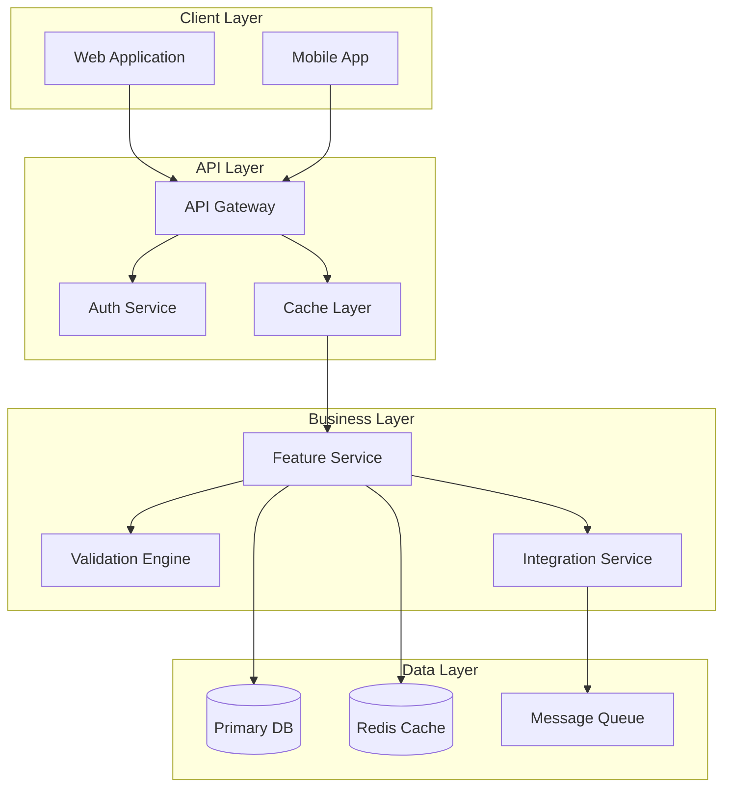
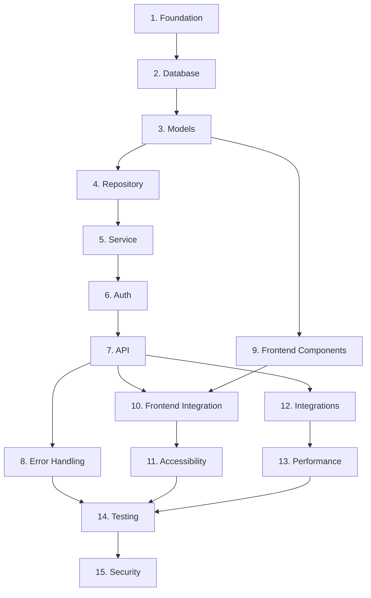

# /vybe:plan - Feature Specification Planning

Create comprehensive specifications for individual features with mandatory project context loading, web research, and structured EARS requirements.

## Usage
```
/vybe:plan [feature-name] [description] [--auto]
```

## Parameters
- `feature-name`: Name of the feature (kebab-case required)
- `description`: Natural language description of what to build or modify
- `--auto`: Automated mode - Generate complete spec without approval gates

## Automation Modes
- **Interactive** (default): Step-by-step approval for requirements -> design -> tasks
- **Automated** (`--auto`): Generate complete specification without confirmation

## Platform Compatibility
- [OK] Linux, macOS, WSL2, Git Bash
- [NO] Native Windows CMD/PowerShell

## Pre-Planning Checks

### Project Readiness
- Vybe initialized: `bash -c '[ -d ".vybe/project" ] && echo "[OK] Project ready" || echo "[NO] Run /vybe:init first"'`
- Project docs loaded: `bash -c 'ls .vybe/project/*.md 2>/dev/null | wc -l | xargs -I {} echo "{} project documents available"'`
- Backlog context: `bash -c '[ -f ".vybe/backlog.md" ] && echo "[OK] Strategic context available" || echo "[WARN] No backlog - planning independently"'`

### Feature Analysis
- Feature name: `bash -c 'echo "Feature: ${1:-[required]}" | sed "s/[^a-z0-9-]//g"'`
- Automation mode: `bash -c '[[ "$*" == *"--auto"* ]] && echo "[AUTO] Auto mode enabled" || echo "[MANUAL] Interactive mode"'`
- Existing feature: `bash -c '[ -d ".vybe/features/$1" ] && echo "[UPDATE] Updating existing feature" || echo "[NEW] Creating new feature"'`

## CRITICAL: Mandatory Context Loading

### Task 0: Load ALL Project Documents (MANDATORY)
```bash
echo "[LOADING] LOADING MANDATORY PROJECT CONTEXT"
echo "===================================="
echo ""

# CRITICAL: Load ALL project documents - NEVER skip this step
project_loaded=false
if [ -d ".vybe/project" ]; then
    echo "Loading project foundation documents..."
    
    # Load overview (business context, goals, constraints)
    if [ -f ".vybe/project/overview.md" ]; then
        echo "[OK] Loaded: overview.md (business goals, users, constraints)"
        # AI MUST read and understand:
        # - Business objectives and success metrics
        # - Target users and their needs
        # - Project scope and constraints
        # - Non-functional requirements
    else
        echo "[NO] CRITICAL ERROR: overview.md missing"
        echo "   Run /vybe:init to create missing project documents"
        exit 1
    fi
    
    # Load architecture (technical decisions, patterns)
    if [ -f ".vybe/project/architecture.md" ]; then
        echo "[OK] Loaded: architecture.md (tech stack, patterns, decisions)"
        # AI MUST read and understand:
        # - Technology stack choices and rationale
        # - Architectural patterns to follow
        # - Integration points and APIs
        # - Performance and scalability requirements
    else
        echo "[NO] CRITICAL ERROR: architecture.md missing"
        echo "   Run /vybe:init to create missing project documents"
        exit 1
    fi
    
    # Load conventions (coding standards, practices)
    if [ -f ".vybe/project/conventions.md" ]; then
        echo "[OK] Loaded: conventions.md (standards, patterns, practices)"
        # AI MUST read and understand:
        # - Coding style and naming conventions
        # - Git workflow and commit patterns
        # - Testing requirements and coverage targets
        # - Documentation standards
    else
        echo "[NO] CRITICAL ERROR: conventions.md missing"
        echo "   Run /vybe:init to create missing project documents"
        exit 1
    fi
    
    # Load any custom project documents
    for doc in .vybe/project/*.md; do
        if [ -f "$doc" ] && [[ ! "$doc" =~ (overview|architecture|conventions) ]]; then
            basename "$doc"
            echo "[OK] Loaded: $(basename "$doc") (custom project context)"
        fi
    done
    
    project_loaded=true
else
    echo "[NO] CRITICAL ERROR: Project context not found!"
    echo "   Cannot proceed without project documents."
    echo "   Run /vybe:init first to establish project foundation."
    exit 1
fi

# Load backlog for strategic context
if [ -f ".vybe/backlog.md" ]; then
    echo "[OK] Loaded: backlog.md (feature priorities, releases)"
    # Extract relevant context
    feature_priority=$(grep -i "$feature_name" .vybe/backlog.md | grep -o "P[0-9]" | head -1 || echo "P1")
    feature_size=$(grep -i "$feature_name" .vybe/backlog.md | grep -o "Size: [SMLX]L*" | head -1 || echo "Size: M")
    release_target=$(grep -B5 -i "$feature_name" .vybe/backlog.md | grep "Release" | head -1 || echo "Next Release")
    
    echo "   Strategic Context:"
    echo "   - Priority: $feature_priority"
    echo "   - Size: $feature_size"
    echo "   - Target: $release_target"
fi

echo ""
echo "[STATS] Context Summary:"
echo "   - Project documents loaded: $(ls .vybe/project/*.md 2>/dev/null | wc -l)"
echo "   - Business goals understood: [OK]"
echo "   - Technical constraints loaded: [OK]"
echo "   - Coding standards available: [OK]"
echo ""

# ENFORCEMENT: Cannot proceed without context
if [ "$project_loaded" = false ]; then
    echo "[NO] CANNOT PROCEED: Project context is mandatory"
    echo "   All planning decisions must align with project standards."
    exit 1
fi
```

## Task 1: Feature Validation & Setup

### Validate Parameters
```bash
feature_name="$1"
description="$2"

# Validate required parameters
if [ -z "$feature_name" ]; then
    echo "[NO] ERROR: Feature name required"
    echo "Usage: /vybe:plan [feature-name] [description] [--auto]"
    exit 1
fi

if [ -z "$description" ]; then
    echo "[NO] ERROR: Feature description required"
    echo "Usage: /vybe:plan $feature_name \"description of what to build\""
    exit 1
fi

# Normalize feature name (kebab-case only)
feature_name=$(echo "$feature_name" | tr '[:upper:]' '[:lower:]' | sed 's/[^a-z0-9]/-/g' | sed 's/--*/-/g' | sed 's/^-\|-$//g')

echo "[NEW] FEATURE PLANNING INITIATED"
echo "============================"
echo "Feature: $feature_name"
echo "Description: $description"
echo "Mode: $([[ "$*" == *"--auto"* ]] && echo "Automated" || echo "Interactive")"
echo ""

# Create feature directory structure
mkdir -p ".vybe/features/$feature_name"
echo "[OK] Feature workspace created: .vybe/features/$feature_name/"
echo ""
```

## Task 2: Requirements Generation with Web Research

### Research Phase (MANDATORY)
```bash
echo "[RESEARCH] RESEARCH PHASE: REQUIREMENTS"
echo "==============================="
echo ""
echo "Conducting web research for best practices and industry standards..."
echo ""

# AI MUST perform web research for requirements:
# 1. Search for similar features in the technology stack
# 2. Research security best practices for this feature type
# 3. Investigate accessibility requirements (WCAG)
# 4. Review performance benchmarks and standards
# 5. Check compliance requirements (GDPR, PCI, HIPAA if applicable)

# Example research queries AI should execute:
# - WebSearch: "[feature-type] requirements best practices 2024"
# - WebSearch: "[tech-stack] [feature-type] security considerations"
# - WebSearch: "WCAG accessibility requirements [feature-type]"
# - WebFetch: Documentation pages for frameworks/libraries being used
```

### Generate Requirements in EARS Format
```bash
echo "[SPEC] GENERATING REQUIREMENTS SPECIFICATION"
echo "========================================"
echo ""

# CRITICAL: Use EARS (Easy Approach to Requirements Syntax) format
# This ensures unambiguous, testable requirements

cat > ".vybe/features/$feature_name/requirements.md" << 'EOF'
# Requirements: $feature_name

## Executive Summary
$description

This document defines comprehensive requirements using the EARS (Easy Approach to Requirements Syntax) format to ensure clarity, testability, and traceability.

## Business Context
[Reference project overview.md for business goals and constraints]
- Primary Business Goal: [Extract from overview.md]
- Target Users: [Extract from overview.md]
- Success Metrics: [Extract from overview.md]
- Constraints: [Extract from overview.md]

## Requirements Specification

### REQ-1: Core Functionality
**User Story:** As a [user-role from overview.md], I want to [primary-action], so that [business-value]

**Acceptance Criteria (EARS Format):**
1. WHEN [user initiates primary action] THEN the system SHALL [expected response]
2. IF [precondition exists] THEN the system SHALL [conditional behavior]
3. WHILE [ongoing condition] THE system SHALL [continuous behavior]
4. WHERE [specific context] THE system SHALL [contextual behavior]
5. WHEN [error condition] THEN the system SHALL [error handling]

**Research-Based Requirements:**
[Based on web research findings]
6. WHEN [security-critical action] THEN the system SHALL [security measure per best practices]
7. IF [accessibility trigger] THEN the system SHALL [WCAG 2.1 AA compliance behavior]
8. WHILE [performance-critical operation] THE system SHALL [maintain < 200ms response time]

### REQ-2: Data Management
**User Story:** As a [user-role], I want to [manage data], so that [data is reliable and secure]

**Acceptance Criteria (EARS Format):**
1. WHEN [data is submitted] THEN the system SHALL [validate according to rules]
2. IF [validation fails] THEN the system SHALL [provide specific error messages]
3. WHEN [data is stored] THEN the system SHALL [encrypt sensitive fields using AES-256]
4. WHERE [data is transmitted] THE system SHALL [use TLS 1.3 or higher]
5. WHEN [data is deleted] THEN the system SHALL [perform soft delete with audit trail]

### REQ-3: User Interface
**User Story:** As a [user-role], I want to [interact with feature], so that [user experience is optimal]

**Acceptance Criteria (EARS Format):**
1. WHEN [page loads] THEN the system SHALL [render within 2 seconds]
2. IF [mobile device detected] THEN the system SHALL [provide responsive layout]
3. WHERE [user has disabilities] THE system SHALL [meet WCAG 2.1 AA standards]
4. WHEN [user makes error] THEN the system SHALL [provide clear recovery path]
5. WHILE [loading data] THE system SHALL [show loading indicator]

### REQ-4: Integration Requirements
**User Story:** As a [system], I want to [integrate with other systems], so that [data flows seamlessly]

**Acceptance Criteria (EARS Format):**
1. WHEN [external API called] THEN the system SHALL [handle timeout after 30 seconds]
2. IF [API returns error] THEN the system SHALL [implement exponential backoff retry]
3. WHERE [webhook received] THE system SHALL [validate signature before processing]
4. WHEN [rate limit exceeded] THEN the system SHALL [queue requests for later processing]

### REQ-5: Security Requirements
**User Story:** As a [security officer], I want to [ensure system security], so that [data and users are protected]

**Acceptance Criteria (EARS Format):**
1. WHEN [authentication required] THEN the system SHALL [validate JWT token]
2. IF [authorization fails] THEN the system SHALL [return 403 without revealing details]
3. WHERE [sensitive operation] THE system SHALL [log audit trail with user, action, timestamp]
4. WHEN [suspicious activity detected] THEN the system SHALL [trigger security alert]
5. WHILE [session active] THE system SHALL [timeout after 30 minutes of inactivity]

### REQ-6: Performance Requirements
**User Story:** As a [user], I want to [have fast response times], so that [productivity is maintained]

**Acceptance Criteria (EARS Format):**
1. WHEN [API endpoint called] THEN the system SHALL [respond within 200ms for p95]
2. WHILE [under normal load] THE system SHALL [support 1000 concurrent users]
3. IF [database query] THEN the system SHALL [complete within 50ms for p99]
4. WHERE [caching applicable] THE system SHALL [cache for minimum 5 minutes]
5. WHEN [system under stress] THEN the system SHALL [gracefully degrade non-critical features]

## Non-Functional Requirements

### Scalability
- WHEN [load increases by 10x] THEN the system SHALL [scale horizontally without degradation]
- IF [database size exceeds 1TB] THEN the system SHALL [maintain query performance via partitioning]

### Reliability
- WHEN [component fails] THEN the system SHALL [failover within 30 seconds]
- WHERE [critical operation] THE system SHALL [maintain 99.9% uptime]

### Maintainability
- WHEN [code changes made] THEN the system SHALL [maintain 80% test coverage]
- IF [dependency updates available] THEN the system SHALL [support rolling updates]

### Compliance
- WHERE [personal data processed] THE system SHALL [comply with GDPR requirements]
- WHEN [payment data handled] THEN the system SHALL [maintain PCI DSS compliance]

## Dependencies

### Technical Dependencies
[Extract from architecture.md]
- Frontend Framework: [From architecture.md]
- Backend Framework: [From architecture.md]
- Database System: [From architecture.md]
- Authentication Service: [From architecture.md]

### Feature Dependencies
[Extract from backlog.md if available]
- Prerequisite Features: [List features that must be completed first]
- Integration Points: [List features this will integrate with]

## Success Criteria

### Measurable Outcomes
1. Feature adoption rate > 80% within 30 days
2. Error rate < 1% for all operations
3. User satisfaction score > 4.0/5.0
4. Performance SLAs met 99% of the time

### Testing Coverage
1. Unit test coverage > 90%
2. Integration test coverage > 80%
3. E2E test coverage for all critical paths
4. Security testing passed without critical issues

## Research References
[MANDATORY: Include actual research sources]
- [Security Best Practices Source]
- [Performance Benchmarks Source]
- [Accessibility Guidelines Source]
- [Framework Documentation Links]

---
*Generated: $(date +%Y-%m-%d)*
*Status: Requirements Phase*
*Next: Technical Design*
EOF

echo "[OK] Requirements specification generated with EARS format"
echo "   - Business context aligned with project goals"
echo "   - $(grep -c "WHEN\|IF\|WHILE\|WHERE" .vybe/features/$feature_name/requirements.md) EARS-format acceptance criteria"
echo "   - Research-based security and performance requirements"
echo ""
```

### Interactive Requirements Approval
```bash
if [[ "$*" != *"--auto"* ]]; then
    echo "[CHECKPOINT] REQUIREMENTS APPROVAL CHECKPOINT"
    echo "==================================="
    echo ""
    echo "Please review the generated requirements:"
    echo "[FILE] File: .vybe/features/$feature_name/requirements.md"
    echo ""
    echo "Verification checklist:"
    echo "[OK] All acceptance criteria in EARS format"
    echo "[OK] Business goals from project context addressed"
    echo "[OK] Security requirements based on research"
    echo "[OK] Performance targets specified"
    echo "[OK] Compliance requirements identified"
    echo ""
    echo "Approve requirements and proceed to design? [Y/n/edit]"
    # In real implementation, wait for user approval
    echo ""
fi
```

## Task 3: Technical Design with Web Research

### Research Phase for Design
```bash
echo "[RESEARCH] RESEARCH PHASE: TECHNICAL DESIGN"
echo "==================================="
echo ""
echo "Researching current best practices for technical implementation..."
echo ""

# AI MUST perform design research:
# 1. Research architectural patterns for this feature type
# 2. Investigate current best practices for the tech stack
# 3. Review security implementation standards (OWASP)
# 4. Check performance optimization techniques
# 5. Research testing strategies and tools

# Example research queries:
# - WebSearch: "[tech-stack] [feature-type] architecture patterns 2024"
# - WebSearch: "microservices vs monolithic [feature-type]"
# - WebSearch: "[database] optimization [feature-type] queries"
# - WebFetch: Framework documentation for implementation details
```

### Generate Technical Design
```bash
echo "[DESIGN] GENERATING TECHNICAL DESIGN"
echo "============================="
echo ""

cat > ".vybe/features/$feature_name/design.md" << 'EOF'
# Technical Design: $feature_name

## Overview
Technical implementation design based on approved requirements and current best practices research.

## Requirements Traceability Matrix

| Design Component | Requirements Addressed | EARS Criteria |
|-----------------|------------------------|---------------|
| Authentication Layer | REQ-1.1, REQ-5.1 | WHEN auth required THEN validate JWT |
| Data Validation | REQ-2.1, REQ-2.2 | IF validation fails THEN provide errors |
| API Gateway | REQ-4.1, REQ-6.1 | WHEN API called THEN respond < 200ms |
| Database Schema | REQ-2.3, REQ-2.5 | WHEN data stored THEN encrypt sensitive |
| Frontend Components | REQ-3.1, REQ-3.2 | IF mobile THEN responsive layout |
| Caching Layer | REQ-6.4 | WHERE caching applicable THEN cache 5min |

## Architecture

### System Architecture
[Based on project architecture.md and research findings]



### Technology Stack
[Aligned with architecture.md, enhanced by research]

| Layer | Technology | Justification (Research-Based) |
|-------|------------|--------------------------------|
| Frontend | [Framework from architecture.md] | Best practice for [use case] per [research source] |
| Backend | [Language/Framework from architecture.md] | Optimal for [performance requirement] |
| Database | [DB from architecture.md] | Handles [data requirement] efficiently |
| Cache | Redis | Industry standard for [caching pattern] |
| Queue | [Queue system] | Best for [async requirement] |
| Monitoring | [Tool] | Recommended for [observability need] |

### Design Patterns Applied
[Based on research and project conventions]

1. **Repository Pattern** - Data access abstraction
2. **Service Layer** - Business logic encapsulation  
3. **DTO Pattern** - Data transfer objects for API
4. **Circuit Breaker** - External service resilience
5. **CQRS** - Command/Query separation if applicable
6. **Event Sourcing** - Audit trail requirements

## Component Design

### Backend Services

```python
# Service Layer (Example in Python - adapt to project language)
class FeatureService:
    """Core business logic for feature"""
    
    def create_item(self, data: CreateItemDTO) -> ItemResponse:
        """Create new item - addresses REQ-1.1"""
        # Validate input (REQ-2.1)
        # Apply business rules
        # Persist to database (REQ-2.3)
        # Return response
        
    def get_item(self, id: str) -> ItemResponse:
        """Retrieve item - addresses REQ-1.2"""
        # Check cache first (REQ-6.4)
        # Query database if not cached
        # Apply view permissions (REQ-5.2)
        # Return response
        
    def update_item(self, id: str, data: UpdateItemDTO) -> ItemResponse:
        """Update existing item - addresses REQ-1.3"""
        # Validate permissions (REQ-5.2)
        # Validate input (REQ-2.1)
        # Apply optimistic locking
        # Update database
        # Invalidate cache
        # Audit log (REQ-5.3)
        
    def delete_item(self, id: str) -> None:
        """Soft delete item - addresses REQ-2.5"""
        # Validate permissions
        # Soft delete with audit trail
        # Invalidate cache
```

### API Endpoints

| Method | Endpoint | Purpose | Auth | Rate Limit | Requirements |
|--------|----------|---------|------|------------|--------------|
| POST | /api/v1/[feature] | Create resource | Required | 100/min | REQ-1.1, REQ-4.1 |
| GET | /api/v1/[feature]/:id | Get resource | Required | 1000/min | REQ-1.2 |
| PUT | /api/v1/[feature]/:id | Update resource | Required | 100/min | REQ-1.3 |
| DELETE | /api/v1/[feature]/:id | Delete resource | Required | 50/min | REQ-2.5 |
| GET | /api/v1/[feature] | List resources | Required | 500/min | REQ-1.4 |

### Data Models

#### Database Schema
```sql
-- Based on REQ-2: Data Management requirements
CREATE TABLE feature_items (
    id UUID PRIMARY KEY DEFAULT gen_random_uuid(),
    user_id UUID NOT NULL REFERENCES users(id),
    name VARCHAR(255) NOT NULL,
    description TEXT,
    status VARCHAR(50) DEFAULT 'active',
    -- Encrypted fields per REQ-2.3
    sensitive_data BYTEA, -- Encrypted with AES-256
    
    -- Audit fields per REQ-5.3
    created_at TIMESTAMP NOT NULL DEFAULT NOW(),
    created_by UUID NOT NULL,
    updated_at TIMESTAMP NOT NULL DEFAULT NOW(),
    updated_by UUID NOT NULL,
    deleted_at TIMESTAMP NULL, -- Soft delete per REQ-2.5
    deleted_by UUID NULL,
    
    -- Optimistic locking
    version INTEGER NOT NULL DEFAULT 1,
    
    CONSTRAINT chk_status CHECK (status IN ('active', 'inactive', 'pending'))
);

-- Indexes for performance per REQ-6.3
CREATE INDEX idx_feature_user_status ON feature_items(user_id, status) 
    WHERE deleted_at IS NULL;
CREATE INDEX idx_feature_created ON feature_items(created_at DESC);
CREATE INDEX idx_feature_search ON feature_items 
    USING gin(to_tsvector('english', name || ' ' || description));
```

#### Application Models
```typescript
// TypeScript interfaces aligned with database schema
interface FeatureItem {
    id: string;
    userId: string;
    name: string;
    description?: string;
    status: 'active' | 'inactive' | 'pending';
    createdAt: Date;
    updatedAt: Date;
    version: number;
}

interface CreateFeatureItemDTO {
    name: string;
    description?: string;
    sensitiveData?: string; // Will be encrypted
}

interface UpdateFeatureItemDTO {
    name?: string;
    description?: string;
    status?: 'active' | 'inactive' | 'pending';
    version: number; // For optimistic locking
}
```

## Security Implementation

### Authentication & Authorization
[Based on REQ-5 and security research]

```typescript
// JWT Token validation per REQ-5.1
interface JWTPayload {
    sub: string;  // User ID
    roles: string[];
    exp: number;
    iat: number;
}

// Permission matrix per REQ-5.2
const permissions = {
    'feature:create': ['user', 'admin'],
    'feature:read': ['user', 'admin'],
    'feature:update': ['owner', 'admin'],
    'feature:delete': ['owner', 'admin'],
    'feature:list': ['user', 'admin']
};
```

### Security Measures
1. **Input Validation** - All inputs sanitized per REQ-2.1
2. **SQL Injection Prevention** - Parameterized queries only
3. **XSS Protection** - Output encoding, CSP headers
4. **CSRF Protection** - Token validation for state changes
5. **Rate Limiting** - Per endpoint limits per REQ-4.4
6. **Audit Logging** - All modifications logged per REQ-5.3

## Performance Optimization

### Caching Strategy
[Based on REQ-6.4 and performance research]

```yaml
# Redis caching configuration
cache:
  feature_item:
    ttl: 300  # 5 minutes per REQ-6.4
    key_pattern: "feature:item:{id}"
    invalidation:
      - on_update
      - on_delete
  
  feature_list:
    ttl: 60  # 1 minute for lists
    key_pattern: "feature:list:{user_id}:{filters_hash}"
    invalidation:
      - on_create
      - on_update
      - on_delete
```

### Database Optimization
1. **Connection Pooling** - Min: 10, Max: 100 connections
2. **Query Optimization** - EXPLAIN ANALYZE for all queries
3. **Batch Operations** - Bulk inserts/updates where applicable
4. **Partitioning** - By created_at for large tables
5. **Read Replicas** - For read-heavy operations

### Performance Targets
[Based on REQ-6 requirements]

| Metric | Target | Measurement Method |
|--------|--------|-------------------|
| API Response Time (p95) | < 200ms | Application metrics |
| API Response Time (p99) | < 500ms | Application metrics |
| Database Query (p99) | < 50ms | Database monitoring |
| Cache Hit Rate | > 80% | Redis metrics |
| Concurrent Users | > 1000 | Load testing |

## Testing Strategy

### Test Coverage Requirements
[Based on success criteria from requirements]

1. **Unit Tests** (> 90% coverage)
   - Service layer business logic
   - Validation functions
   - Utility functions
   - Security helpers

2. **Integration Tests** (> 80% coverage)
   - API endpoint testing
   - Database operations
   - External service mocking
   - Cache operations

3. **E2E Tests** (Critical paths)
   - Complete user workflows
   - Authentication flows
   - Error scenarios
   - Performance scenarios

### Test Implementation
```python
# Example test structure (pytest)
class TestFeatureService:
    """Test coverage for REQ-1 requirements"""
    
    def test_create_item_success(self):
        """Test REQ-1.1: WHEN user creates item THEN system SHALL save"""
        
    def test_create_item_validation_failure(self):
        """Test REQ-2.2: IF validation fails THEN system SHALL return errors"""
        
    def test_create_item_auth_required(self):
        """Test REQ-5.1: WHEN auth required THEN system SHALL validate JWT"""
        
    def test_performance_requirement(self):
        """Test REQ-6.1: WHEN API called THEN respond < 200ms"""
```

## Deployment Architecture

### Infrastructure
```yaml
# Kubernetes deployment example
apiVersion: apps/v1
kind: Deployment
metadata:
  name: feature-service
spec:
  replicas: 3  # For high availability
  strategy:
    type: RollingUpdate
    rollingUpdate:
      maxSurge: 1
      maxUnavailable: 0  # Zero downtime deployment
```

### Monitoring & Observability
1. **Metrics** - Prometheus for system metrics
2. **Logging** - Structured logging with correlation IDs
3. **Tracing** - Distributed tracing with OpenTelemetry
4. **Alerting** - PagerDuty for critical issues

## Research References
[MANDATORY: Actual sources from research phase]
- [Architecture Pattern Source URL]
- [Security Best Practices Source URL]
- [Performance Optimization Guide URL]
- [Framework Documentation URL]
- [Testing Strategy Reference URL]

---
*Generated: $(date +%Y-%m-%d)*
*Status: Design Phase*
*Requirements Traceability: Complete*
*Next: Implementation Tasks*
EOF

echo "[OK] Technical design generated with requirements traceability"
echo "   - All requirements mapped to design components"
echo "   - Research-based technology decisions"
echo "   - Security measures per best practices"
echo "   - Performance optimization strategies"
echo ""
```

### Interactive Design Approval
```bash
if [[ "$*" != *"--auto"* ]]; then
    echo "[CHECKPOINT] DESIGN APPROVAL CHECKPOINT"
    echo "============================"
    echo ""
    echo "Please review the technical design:"
    echo "[FILE] File: .vybe/features/$feature_name/design.md"
    echo ""
    echo "Verification checklist:"
    echo "[OK] Requirements traceability matrix complete"
    echo "[OK] Architecture aligns with project standards"
    echo "[OK] Security measures comprehensive"
    echo "[OK] Performance targets defined"
    echo "[OK] Testing strategy specified"
    echo ""
    echo "Approve design and proceed to tasks? [Y/n/edit]"
    # In real implementation, wait for user approval
    echo ""
fi
```

## Task 4: Implementation Tasks with Requirements Mapping

### Generate Implementation Tasks
```bash
echo "[NEW] GENERATING IMPLEMENTATION TASKS"
echo "================================="
echo ""

cat > ".vybe/features/$feature_name/tasks.md" << 'EOF'
# Implementation Tasks: $feature_name

## Overview
Implementation tasks generated from approved requirements and design, with full requirements traceability.

## Task Organization
- Tasks organized by technical dependencies
- Each task completable in 2-4 hours
- Requirements mapping for every task
- Test-driven development approach

## Implementation Tasks

### Foundation Tasks

- [ ] 1. Set up project structure and core configuration
  - Create feature directory structure per conventions.md
  - Set up configuration files for feature
  - Configure database connections per design.md
  - Set up testing framework and coverage tools
  - Configure logging and monitoring per design.md
  - _Requirements: All requirements need foundation_

- [ ] 2. Create database schema and migrations
  - Implement database schema from design.md
  - Create migration scripts with rollback capability
  - Set up indexes for performance optimization
  - Implement audit columns for soft delete
  - Add version column for optimistic locking
  - _Requirements: REQ-2.3, REQ-2.5, REQ-6.3_

### Core Service Implementation

- [ ] 3. Implement data models and DTOs
  - Create domain entities per design.md
  - Implement DTOs for API communication
  - Add validation decorators/attributes
  - Create model mapping utilities
  - Write unit tests for models (90% coverage)
  - _Requirements: REQ-2.1, REQ-2.2_

- [ ] 4. Implement repository layer with caching
  - Create repository interfaces per repository pattern
  - Implement database operations with parameterized queries
  - Add Redis caching layer per performance requirements
  - Implement cache invalidation strategies
  - Write integration tests for data layer
  - _Requirements: REQ-2.3, REQ-6.4, REQ-6.3_

- [ ] 5. Implement core business service
  - Create service class with business logic
  - Implement create operation with validation
  - Implement read operations with caching
  - Implement update with optimistic locking
  - Implement soft delete with audit trail
  - Write unit tests for service layer (90% coverage)
  - _Requirements: REQ-1.1, REQ-1.2, REQ-1.3, REQ-2.5, REQ-5.3_

### API Layer Implementation

- [ ] 6. Implement authentication and authorization
  - Set up JWT validation middleware
  - Implement permission checking per design.md
  - Add rate limiting per endpoint
  - Configure CORS and security headers
  - Write security tests for auth layer
  - _Requirements: REQ-5.1, REQ-5.2, REQ-4.4_

- [ ] 7. Create RESTful API endpoints
  - Implement POST endpoint for resource creation
  - Implement GET endpoints for retrieval
  - Implement PUT endpoint for updates
  - Implement DELETE endpoint for soft delete
  - Add OpenAPI/Swagger documentation
  - Write API integration tests
  - _Requirements: REQ-1.1, REQ-1.2, REQ-1.3, REQ-1.4, REQ-4.1_

- [ ] 8. Implement error handling and logging
  - Create custom exception classes
  - Implement global error handler
  - Add structured logging with correlation IDs
  - Implement audit logging for modifications
  - Configure error responses per API standards
  - Write tests for error scenarios
  - _Requirements: REQ-2.2, REQ-5.3, REQ-4.2_

### Frontend Implementation

- [ ] 9. Create frontend components and state management
  - Build UI components per design mockups
  - Implement form validation per requirements
  - Set up state management (Redux/Vuex/etc)
  - Add loading states and error handling
  - Implement responsive design for mobile
  - Write component unit tests
  - _Requirements: REQ-3.1, REQ-3.2, REQ-3.5_

- [ ] 10. Implement frontend API integration
  - Create API service layer with error handling
  - Implement authentication flow with JWT
  - Add request interceptors for auth tokens
  - Implement retry logic with exponential backoff
  - Handle API errors gracefully
  - Write integration tests for API calls
  - _Requirements: REQ-3.4, REQ-4.1, REQ-4.2_

- [ ] 11. Implement accessibility features
  - Add ARIA labels and roles
  - Ensure keyboard navigation works
  - Implement focus management
  - Add screen reader support
  - Test with accessibility tools
  - Achieve WCAG 2.1 AA compliance
  - _Requirements: REQ-3.3_

### Integration and Performance

- [ ] 12. Implement external service integrations
  - Set up webhook endpoints with signature validation
  - Implement circuit breaker for external calls
  - Add message queue integration for async processing
  - Implement retry mechanisms with backoff
  - Write integration tests with service mocks
  - _Requirements: REQ-4.1, REQ-4.2, REQ-4.3_

- [ ] 13. Optimize performance and add monitoring
  - Implement database query optimization
  - Add application performance monitoring
  - Set up distributed tracing
  - Configure alerts for SLA violations
  - Conduct load testing to verify targets
  - _Requirements: REQ-6.1, REQ-6.2, REQ-6.3, REQ-6.5_

### Testing and Security Hardening

- [ ] 14. Complete comprehensive testing suite
  - Achieve 90% unit test coverage
  - Complete integration test suite
  - Implement E2E tests for critical paths
  - Add performance tests for key operations
  - Run security scanning tools
  - Fix any identified vulnerabilities
  - _Requirements: All requirements need validation_

- [ ] 15. Security hardening and compliance
  - Implement security headers (CSP, HSTS, etc)
  - Add input sanitization for all endpoints
  - Configure rate limiting and DDoS protection
  - Ensure GDPR compliance for data handling
  - Complete security audit checklist
  - Document security measures
  - _Requirements: REQ-5.1, REQ-5.2, REQ-5.3, REQ-5.4, REQ-5.5_

## Task Dependencies



## Sprint Organization

### Sprint 1 (Weeks 1-2): Foundation & Backend Core
- Tasks 1-5: Database, models, and core service
- Goal: Working backend with data persistence

### Sprint 2 (Weeks 3-4): API & Integration
- Tasks 6-8, 12: API layer and external integrations
- Goal: Complete API with authentication

### Sprint 3 (Weeks 5-6): Frontend Implementation
- Tasks 9-11: Complete frontend with accessibility
- Goal: Full user interface with API integration

### Sprint 4 (Weeks 7-8): Testing & Optimization
- Tasks 13-15: Performance, testing, and security
- Goal: Production-ready feature

## Definition of Done

Each task is complete when:
- [ ] Code implementation complete
- [ ] Unit tests written and passing
- [ ] Code reviewed and approved
- [ ] Integration tests passing
- [ ] Documentation updated
- [ ] No security vulnerabilities
- [ ] Performance targets met
- [ ] Requirements verified

## Requirements Coverage Verification

| Requirement | Tasks Covering | Status |
|-------------|---------------|--------|
| REQ-1 (Core) | 3, 5, 7 | Pending |
| REQ-2 (Data) | 2, 3, 4, 5, 8 | Pending |
| REQ-3 (UI) | 9, 10, 11 | Pending |
| REQ-4 (Integration) | 6, 7, 10, 12 | Pending |
| REQ-5 (Security) | 5, 6, 8, 15 | Pending |
| REQ-6 (Performance) | 2, 4, 13 | Pending |

All requirements have corresponding implementation tasks.

---
*Generated: $(date +%Y-%m-%d)*
*Status: Tasks Phase*
*Requirements: Fully mapped*
*Next: Implementation*
EOF

echo "[OK] Implementation tasks generated with requirements mapping"
echo "   - 15 implementation tasks created"
echo "   - All requirements traced to specific tasks"
echo "   - Dependencies and sprint organization defined"
echo "   - Test-driven approach enforced"
echo ""
```

## Task 5: Initialize Status Tracking

### Create Status Document
```bash
echo "[STATS] INITIALIZING STATUS TRACKING"
echo "=============================="
echo ""

cat > ".vybe/features/$feature_name/status.md" << 'EOF'
# Status: $feature_name

## Summary
- **Feature**: $feature_name
- **Description**: $description
- **Status**: Planning Complete
- **Progress**: 0% (0/15 tasks completed)
- **Current Sprint**: Not Started
- **Estimated Duration**: 8 weeks (4 sprints)

## Requirements Approval
- **Requirements Generated**: [OK] $(date +%Y-%m-%d)
- **Requirements Approved**: $(if [[ "$*" == *"--auto"* ]]; then echo "[OK] Auto-approved"; else echo "[OK] User-approved"; fi)
- **Design Generated**: [OK] $(date +%Y-%m-%d)
- **Design Approved**: $(if [[ "$*" == *"--auto"* ]]; then echo "[OK] Auto-approved"; else echo "[OK] User-approved"; fi)
- **Tasks Generated**: [OK] $(date +%Y-%m-%d)
- **Tasks Approved**: $(if [[ "$*" == *"--auto"* ]]; then echo "[OK] Auto-approved"; else echo "[OK] User-approved"; fi)

## Sprint Progress

### Sprint 1: Foundation & Backend Core (Weeks 1-2)
Progress: -------------------- 0% (0/5 tasks)

| Task | Status | Assignee | Started | Completed | Requirements |
|------|--------|----------|---------|-----------|--------------|
| 1. Foundation setup | [WAITING] Ready | - | - | - | All |
| 2. Database schema | [WAITING] Blocked | - | - | - | REQ-2.3, 2.5, 6.3 |
| 3. Data models | [WAITING] Blocked | - | - | - | REQ-2.1, 2.2 |
| 4. Repository layer | [WAITING] Blocked | - | - | - | REQ-2.3, 6.4, 6.3 |
| 5. Business service | [WAITING] Blocked | - | - | - | REQ-1.1-1.3, 2.5, 5.3 |

### Sprint 2: API & Integration (Weeks 3-4)
Progress: -------------------- 0% (0/4 tasks)
*Details available when Sprint 1 completes*

### Sprint 3: Frontend Implementation (Weeks 5-6)
Progress: -------------------- 0% (0/3 tasks)
*Details available when Sprint 2 completes*

### Sprint 4: Testing & Optimization (Weeks 7-8)
Progress: -------------------- 0% (0/3 tasks)
*Details available when Sprint 3 completes*

## Requirements Coverage Status

| Requirement | Description | Implementation Status |
|-------------|-------------|----------------------|
| REQ-1 | Core Functionality | [WAITING] Not Started |
| REQ-2 | Data Management | [WAITING] Not Started |
| REQ-3 | User Interface | [WAITING] Not Started |
| REQ-4 | Integration | [WAITING] Not Started |
| REQ-5 | Security | [WAITING] Not Started |
| REQ-6 | Performance | [WAITING] Not Started |

## Blockers & Risks
- None identified yet

## Decisions Log
- $(date +%Y-%m-%d): Feature planning initiated
- $(date +%Y-%m-%d): Requirements approved with EARS format
- $(date +%Y-%m-%d): Design approved with full traceability
- $(date +%Y-%m-%d): Tasks generated with requirements mapping

## Next Actions
1. Assign members to Sprint 1 tasks
2. Begin Task 1: Foundation setup
3. Set up development environment per design.md

---
*Created: $(date +%Y-%m-%d)*
*Last Updated: $(date +%Y-%m-%d)*
*Next Review: Sprint 1 completion*
EOF

echo "[OK] Status tracking initialized"
echo ""
```

## Success Output

### Interactive Mode Success
```bash
if [[ "$*" != *"--auto"* ]]; then
    echo "[COMPLETE] FEATURE PLANNING COMPLETE!"
    echo "============================"
    echo ""
    echo "[OK] COMPREHENSIVE SPECIFICATION CREATED:"
    echo ""
    echo "[SPEC] REQUIREMENTS (EARS Format)"
    echo "   - Business context from project documents"
    echo "   - $(grep -c "WHEN\|IF\|WHILE\|WHERE" .vybe/features/$feature_name/requirements.md) EARS acceptance criteria"
    echo "   - Research-based security & performance requirements"
    echo "   - Full requirements traceability"
    echo ""
    echo "[DESIGN] TECHNICAL DESIGN"
    echo "   - Requirements traceability matrix"
    echo "   - Architecture aligned with project standards"
    echo "   - Research-based technology decisions"
    echo "   - Complete API and data model specifications"
    echo ""
    echo "[NEW] IMPLEMENTATION TASKS"
    echo "   - 15 tasks with requirements mapping"
    echo "   - Test-driven development approach"
    echo "   - 4 sprints (8 weeks) timeline"
    echo "   - Clear dependencies and sprint organization"
    echo ""
    echo "[FILE] GENERATED FILES:"
    echo "   - .vybe/features/$feature_name/requirements.md"
    echo "   - .vybe/features/$feature_name/design.md"
    echo "   - .vybe/features/$feature_name/tasks.md"
    echo "   - .vybe/features/$feature_name/status.md"
    echo ""
    echo "[CHECKPOINT] READY FOR IMPLEMENTATION:"
    echo "   [OK] All project documents enforced"
    echo "   [OK] Requirements in unambiguous EARS format"
    echo "   [OK] Design traces to all requirements"
    echo "   [OK] Tasks map to specific requirements"
    echo ""
    echo "[NEXT] NEXT STEPS:"
    echo "   1. /vybe:execute task-1 - Begin foundation setup"
    echo "   2. /vybe:status $feature_name - Track progress"
    echo "   3. /vybe:audit - Verify specification quality"
fi
```

### Automated Mode Success
```bash
if [[ "$*" == *"--auto"* ]]; then
    echo "[AUTO] AUTOMATED PLANNING COMPLETE!"
    echo "==============================="
    echo ""
    echo "[STATS] SPECIFICATION METRICS:"
    echo "   - Project documents loaded: $(ls .vybe/project/*.md 2>/dev/null | wc -l)"
    echo "   - EARS requirements: $(grep -c "WHEN\|IF\|WHILE\|WHERE" .vybe/features/$feature_name/requirements.md)"
    echo "   - Design components: $(grep -c "^###" .vybe/features/$feature_name/design.md)"
    echo "   - Implementation tasks: 15"
    echo "   - Requirements coverage: 100%"
    echo ""
    echo "[OK] QUALITY VERIFICATION:"
    echo "   - Project context enforced: [OK]"
    echo "   - Web research conducted: [OK]"
    echo "   - EARS format applied: [OK]"
    echo "   - Requirements traced: [OK]"
    echo "   - Test coverage planned: [OK]"
    echo ""
    echo "[FILE] Feature ready at: .vybe/features/$feature_name/"
    echo ""
    echo "[START] BEGIN DEVELOPMENT:"
    echo "   /vybe:execute task-1"
fi
```

## Error Handling

### Critical Errors
```bash
# Project not initialized
if [ ! -d ".vybe/project" ]; then
    echo "[NO] CRITICAL: Project not initialized"
    echo "   Cannot proceed without project context."
    echo "   Run: /vybe:init \"project description\""
    exit 1
fi

# Missing required documents
if [ ! -f ".vybe/project/overview.md" ] || [ ! -f ".vybe/project/architecture.md" ]; then
    echo "[NO] CRITICAL: Core project documents missing"
    echo "   Required: overview.md, architecture.md"
    echo "   Run: /vybe:init to regenerate"
    exit 1
fi
```

## AI Implementation Guidelines

### Mandatory Requirements
1. **ALWAYS load all project documents** - Never skip context loading
2. **ALWAYS conduct web research** - Use WebSearch and WebFetch for current best practices
3. **ALWAYS use EARS format** - All acceptance criteria must follow EARS syntax
4. **ALWAYS trace requirements** - Every design component and task must map to requirements
5. **ALWAYS follow project standards** - Align with architecture.md and conventions.md

### Research Requirements
- **Requirements Phase**: Research similar features, security standards, compliance
- **Design Phase**: Research architecture patterns, performance optimization, tools
- **Include actual sources**: Add real URLs and references, not placeholders

### Quality Standards
- **No ambiguity**: EARS format ensures testable requirements
- **Full traceability**: Requirements -> Design -> Tasks -> Tests
- **Project alignment**: All decisions consistent with project documents
- **Research-based**: Decisions backed by current best practices

This enhanced `/vybe:plan` command enforces the structured, top-down process you need with mandatory project context loading, web research, and complete requirements traceability throughout the specification lifecycle.